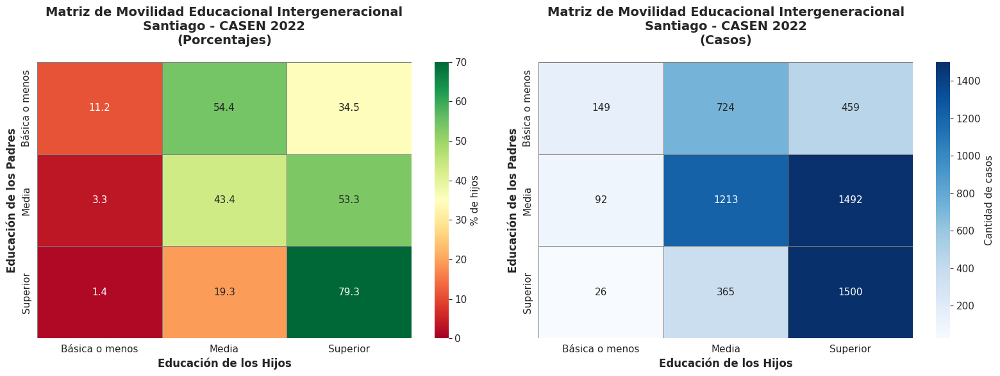
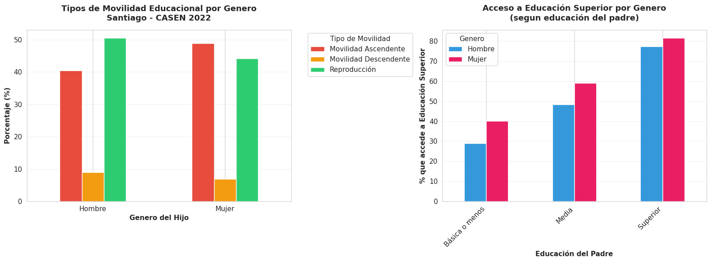
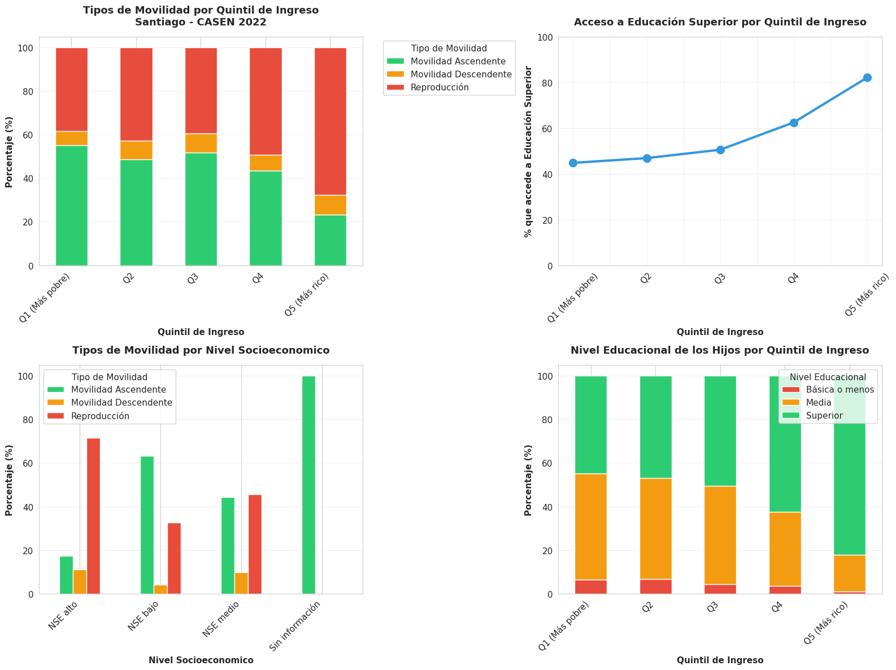

# El Peso de la Cuna: Reproducción Intergeneracional de Capital Educativo en Santiago

Analisis de movilidad educacional intergeneracional en la Región Metropolitana utilizando datos de CASEN 2022.

---

## Descripción

Este proyecto examina la movilidad educacional intergeneracional en Santiago, Chile, utilizando la teoria de reproducción social de Pierre Bourdieu. A través del analisis de 6,020 pares padre-hijo de la encuesta CASEN 2022, se investiga en qué medida el capital educativo se reproduce entre generaciones y cómo factores como el ingreso, el genero y el origen socioeconómico influyen en las oportunidades educacionales.
---

## Tabla de Contenidos

- [Contexto y Motivación](#contexto-y-motivación)
- [Marco Teórico](#marco-teórico)
- [Metodologia](#metodologia)
- [Estructura del Repositorio](#estructura-del-repositorio)
- [Requisitos](#requisitos)
- [Instrucciones de Uso](#instrucciones-de-uso)
- [Resultados Principales](#resultados-principales)
- [Visualizaciones](#visualizaciones)
- [Conclusiones](#conclusiones)
- [Fuentes y Referencias](#fuentes-y-referencias)
- [Contacto](#contacto)
---

## Contexto y Motivación

La educación es frecuentemente considerada como el principal mecanismo de movilidad social en sociedades modernas, sin embargo, diversos estudios sociológicos cuestionan esta premisa, argumentando que el acceso a educación superior está fuertemente condicionado por el origen familiar y el capital cultural heredado.

Este proyecto busca responder:
Pregunta principal:
- ¿En qué medida se reproduce el nivel educacional entre padres e hijos en Santiago?
Preguntas secundarias:
- ¿Existen diferencias significativas por genero o nivel socioeconómico?
- ¿La educación superior es realmente una herramienta de movilidad social o reproduce las desigualdades existentes?

---

## Marco Teórico

El analisis se fundamenta en la **teoria de reproducción social** de Pierre Bourdieu, que sostiene que el capital cultural (educación, conocimientos, códigos culturales) se transmite intergeneracionalmente, perpetuando las desigualdades sociales.

**Conceptos clave:**
- **Capital cultural:** Recursos educativos y culturales heredados del entorno familiar
- **Movilidad educacional ascendente:** Hijos que superan el nivel educacional de sus padres
- **Reproducción social:** Hijos que mantienen el mismo nivel educacional que sus padres
- **Efecto "sticky floor":** Dificultad de salir de los niveles educacionales mas bajos
---

## Metodologia

### Fuente de Datos

**Encuesta CASEN 2022** - Encuesta de Caracterización Socioeconómica Nacional, realizada por el Ministerio de Desarrollo Social y Familia de Chile.

### Muestra

- **Población objetivo:** Hogares de la Región Metropolitana donde residen hijos entre 18-40 años con el jefe de hogar
- **Tamaño de muestra:** 6,020 pares padre-hijo
- **Periodo:** Año 2022

### Variables Principales

**Variables de educación:**
- Nivel educacional del hijo (Educacion_Hijo)
- Nivel educacional del padre/jefe de hogar (Educacion_Padre)
- Años de escolaridad de ambos

**Variables socioeconómicas:**
- Ingreso total del hogar (ytotcorh)
- Ingreso per capita
- Quintil de ingreso

**Variables de control:**
- Sexo del hijo
- Edad del hijo y del padre
- Area de residencia (urbano/rural)

### Proceso de Analisis

1. **Limpieza de datos:** Filtrado de casos validos, identificación de pares padre-hijo en el mismo hogar
2. **Categorización educacional:** Agrupación en tres niveles (Basica o menos, Media, Superior)
3. **Creación de variables derivadas:** 
   - Tipo de movilidad (Ascendente, Reproducción, Descendente)
   - Quintiles de ingreso
   - Nivel socioeconómico
4. **Analisis exploratorio:** Matrices de movilidad, calculos de odds ratios, analisis por genero y quintil
5. **Visualización:** Graficos y heatmaps para comunicar hallazgos

### Herramientas Utilizadas

- **Python 3.x:** Procesamiento y analisis de datos
- **Bibliotecas:** pandas, numpy, matplotlib, seaborn, pyreadstat
- **Google Colab:** Entorno de desarrollo
- **Formato de datos:** CSV (UTF-8)

---

## Estructura del Repositorio
```
Coco-and-data/
│
├── README.md                                          
│
├── analisis_movilidad_educacional_casen2022.ipynb    
│
├── CASEN_Movilidad_Educacional_Santiago_FINAL.csv    
│
├── Output-1.png                                       
├── Output-2.png                                       
└── Output-3.png                                       
```

### Descripción de Archivos

**analisis_movilidad_educacional_casen2022.ipynb**
- Notebook completo con codigo documentado
- Incluye limpieza, procesamiento, analisis exploratorio y visualizaciones
- Comentarios explicativos en cada paso

**CASEN_Movilidad_Educacional_Santiago_FINAL.csv**
- Dataset procesado con 6,020 pares padre-hijo
- Variables: educación, ingreso, tipo de movilidad, datos demograficos
- Listo para analisis o visualización

**Output-1.png, Output-2.png, Output-3.png**
- Graficos principales del analisis exploratorio
- Heatmaps, matrices y graficos de lineas
- Alta resolución para presentaciones
---

## Requisitos

### Dependencias de Python
```python
pandas>=1.5.0
numpy>=1.23.0
matplotlib>=3.6.0
seaborn>=0.12.0
pyreadstat>=1.2.0
```

### Instalación

Para replicar el analisis, instala las dependencias necesarias:
```bash
pip install pandas numpy matplotlib seaborn pyreadstat
```

O si usas Google Colab, pyreadstat se instala con:
```bash
!pip install pyreadstat
```

---

## Instrucciones de Uso

### Opción 1: Ejecutar el Notebook Completo

1. Clona este repositorio:
```bash
git clone https://github.com/tu-usuario/Coco-and-data.git
cd Coco-and-data
```

2. Abre el notebook en Jupyter o Google Colab:
```bash
jupyter notebook analisis_movilidad_educacional_casen2022.ipynb
```

3. Ejecuta las celdas secuencialmente para reproducir todo el analisis

### Opción 2: Usar el Dataset Procesado

Si solo quieres trabajar con los datos limpios:
```python
import pandas as pd

# Cargar dataset procesado
df = pd.read_csv('CASEN_Movilidad_Educacional_Santiago_FINAL.csv')

# Explorar datos
print(df.head())
print(df.columns)
```

### Opción 3: Replicar desde Datos Originales

1. Descarga la base de datos original CASEN 2022 desde: 
   http://observatorio.ministeriodesarrollosocial.gob.cl/
2. Sigue el codigo del notebook desde la seccion de "Carga de Datos"
3. El notebook esta completamente documentado paso a paso
---

## Resultados Principales

### Hallazgos Clave

#### 1. Alta Reproducción del Capital Educativo

- **47.5%** de reproducción social: los hijos mantienen el mismo nivel educacional que sus padres
- **79.3%** de hijos de padres con educación superior también alcanzan educación superior
- Solo **34.5%** de hijos de padres con educación basica o menos accede a educación superior

#### 2. Desigualdad de Oportunidades

- Un hijo de padre con educación superior tiene **2.3 veces mas probabilidad** de acceder a educación superior comparado con un hijo de padre con educación basica
- Brecha por quintil de ingreso: **37.3 puntos porcentuales** entre Q5 (mas rico: 82.1%) y Q1 (mas pobre: 44.8%)

#### 3. Efecto "Sticky Floor"

- **65.5%** de hijos de padres con educación basica o menos NO logra superar educación media
- Existe un "suelo pegajoso" que dificulta la movilidad educacional desde los niveles mas bajos

#### 4. Dimension de Genero

- Las mujeres tienen **8.5 puntos porcentuales MAS** de movilidad educacional ascendente que los hombres
- Esta ventaja femenina se mantiene en todos los niveles socioeconómicos
- Movilidad ascendente: Mujeres 48.9% vs Hombres 40.4%

### Matriz de Movilidad Educacional

|                    | Basica o menos | Media  | Superior |
|--------------------|----------------|--------|----------|
| **Basica o menos** | 11.2%          | 54.4%  | 34.5%    |
| **Media**          | 3.3%           | 43.4%  | 53.3%    |
| **Superior**       | 1.4%           | 19.3%  | 79.3%    |

*Nota: Porcentaje de hijos que alcanzan cada nivel educacional segun educación del padre*

### Metricas Estadisticas

- **Tasa de Movilidad Ascendente:** 44.4%
- **Tasa de Movilidad Descendente:** 8.0%
- **Odds Ratio (Superior vs Basica):** 2.3x
- **Correlación educación padre-hijo:** Alta (reproducción significativa)
---

## Visualizaciones

### Matriz de Movilidad Educacional Intergeneracional



*Heatmap que muestra el porcentaje de hijos que alcanzan cada nivel educacional segun la educación de sus padres. Los colores mas oscuros indican mayor concentración de casos.*

**Lectura clave:** La diagonal muestra alta reproducción, especialmente en educación superior (79.3%).

---

### Movilidad Educacional por Genero



*Comparación de tipos de movilidad educacional entre hombres y mujeres, y acceso a educación superior segun educación del padre.*

**Lectura clave:** Las mujeres superan a los hombres en movilidad ascendente en todos los niveles socioeconómicos.

---

### Desigualdad en el Acceso a Educación Superior segun Quintil de Ingreso



*Grafico de lineas que muestra el porcentaje de acceso a educación superior por quintil de ingreso, y tipos de movilidad por nivel socioeconómico.*

**Lectura clave:** Existe una brecha de 37.3 puntos porcentuales entre el quintil mas rico y el mas pobre.
---

## Conclusiones

### Confirmación de la Teoria de Bourdieu

Los datos confirman empíricamente la **teoria de reproducción social** de Pierre Bourdieu: el capital educativo se transmite intergeneracionalmente de manera significativa. La educación del padre/jefe de hogar es un fuerte predictor del logro educacional de los hijos en Santiago.

### Limitaciones de la Meritocracia

Si bien existe movilidad educacional ascendente (44.4%), esta es **limitada y desigual**:
- Solo 1 de cada 3 hijos de padres con educación basica accede a educación superior
- 8 de cada 10 hijos de padres con educación superior también la alcanzan
- El origen familiar sigue siendo mas determinante que el merito individual

### Persistencia del "Suelo Pegajoso"

El **efecto sticky floor** es evidente: dos tercios de los hijos de padres con baja educación no logran superar educación media, quedando atrapados en los niveles educacionales mas bajos de la estructura social.

### Desigualdad Estructural

La brecha de 37.3 puntos porcentuales entre quintiles extremos demuestra que la desigualdad socioeconómica se traduce directamente en desigualdad de oportunidades educacionales.

### Avance en Equidad de Genero

Un hallazgo positivo es la mayor movilidad educacional de las mujeres, sugiriendo que las politicas de equidad de genero en educación han tenido impacto. Sin embargo, esta ventaja no compensa completamente las desventajas de origen socioeconómico.

---

## Fuentes y Referencias

### Fuente de Datos

**Ministerio de Desarrollo Social y Familia - Gobierno de Chile**
- Encuesta CASEN 2022 - Encuesta de Caracterización Socioeconómica Nacional
- Sitio web: http://observatorio.ministeriodesarrollosocial.gob.cl/
- Base de datos SPSS version 18 de marzo 2024

### Referencias Bibliograficas

**Teoria sociologica:**
- Bourdieu, P. (1986). "The Forms of Capital". En Richardson, J. (Ed.), *Handbook of Theory and Research for the Sociology of Education*. Greenwood Press.

**Estudios sobre movilidad social en Chile:**
- Torche, F. (2005). "Unequal but Fluid: Social Mobility in Chile in Comparative Perspective". *American Sociological Review*, 70(3), 422-450.
- Núñez, J. & Miranda, L. (2010). "Intergenerational Income Mobility in a Less-Developed, High-Inequality Context: The Case of Chile". *The B.E. Journal of Economic Analysis & Policy*, 10(1).

**Contexto internacional:**
- OECD (2018). "A Broken Social Elevator? How to Promote Social Mobility". OECD Publishing, Paris.

### Documentación Tecnica

- Ministerio de Desarrollo Social y Familia (2024). "Manual del Investigador - Encuesta CASEN 2022"
- Ministerio de Desarrollo Social y Familia (2024). "Libro de Codigos - Base de Datos CASEN 2022"

### Herramientas y Librerias

- Python Software Foundation. Python Language Reference, version 3.x. https://www.python.org
- McKinney, W. (2010). "Data Structures for Statistical Computing in Python". *Proceedings of the 9th Python in Science Conference*, 56-61.
- Hunter, J.D. (2007). "Matplotlib: A 2D Graphics Environment". *Computing in Science & Engineering*, 9(3), 90-95.
---

## Contacto

**Autor:** Simone Schöndorfer

**Email:** simone.schondorfer.010@gmailcom

**LinkedIn:** https://www.linkedin.com/in/simone-schöndorfer-60088b2a0/

**GitHub:** https://github.com/Coco-and-data

---

## Licencia

Este proyecto se comparte con fines educativos y de investigación. Los datos utilizados provienen de fuentes publicas (CASEN 2022) y estan sujetos a las condiciones de uso establecidas por el Ministerio de Desarrollo Social y Familia de Chile.

---


## Notas

- Este analisis es independiente y no representa posiciones oficiales del Ministerio de Desarrollo Social y Familia
- Los resultados son especificos para la Región Metropolitana y el año 2022
- Para analisis mas amplios o actualizados, consultar directamente las fuentes oficiales

---

**Ultima actualización:** Diciembre 2024

**Version:** 1.0
